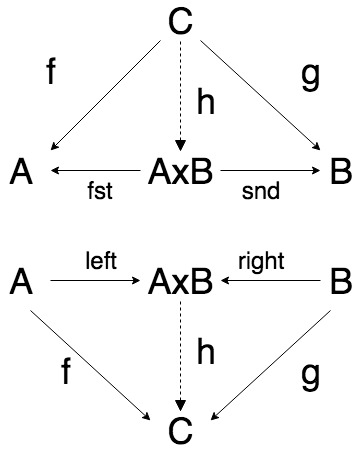

# Category Theory - Duals

Some code inspired by Phillip Wadler's talk at Strageloop 2018 "Categories for the Working Hacker". He described the Product and Sum categories, using Java and Haskell to demonstrate the types. 

I decided to rewrite them in Scala, to improve my understanding of the talk.
